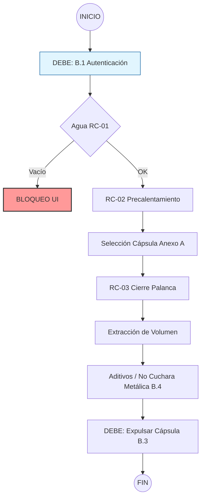

# ☕ Ventura-Coffee: UX Flow Design  

**De la Norma Técnica a la Interfaz de Usuario.**  
Transformación de la normativa **NT-KAF-E:2024** en una experiencia digital fluida, segura y guiada.

Para iniciar el proyecto se puede clonar y despplegar en local (npm install, npm run dev) o usar la url de despliegue (https://ventura-coffee.vercel.app).

En el Login no hace falta ningún código especial, ya que no se ha implementado un control real del usuario. Simplemente con teclear 4 dígitos es más que suficiente para que nos deje continuar.

Si en un futuro se requiere validación concreta, aplicarla es posible y fácil de implementar.

---

## 🎯 El Desafío

El objetivo principal fue traducir una norma técnica burocrática y fragmentada en un flujo de usuario donde el cumplimiento de los estándares de calidad y seguridad sea automático.

El usuario final logra la excelencia en su café sin necesidad de leer manuales, gracias a un sistema de bloqueos inteligentes y jerarquía visual.

---

## 🛠️ Metodología de Diseño (Proceso Iterativo)

### 1️⃣ Análisis de la Norma Técnica (NT-KAF-E:2024)

Desglose del documento normativo para extraer la lógica operativa del sistema:

#### 🔎 Fases Operativas
Identificación de 8 fases críticas (8.1–8.4 + Anexo B).

#### ⚠️ Mapeo de Riesgos (RC)
- **RC-01:** Control de nivel de agua  
- **RC-02:** Gestión de precalentamiento  
- **RC-03:** Bloqueo de palanca de carga  

#### 🎨 Semántica de Interfaz
- 🔴 **DEBE (Obligatorio):** Bloqueo total de la UI hasta cumplimiento  
- 🟡 **DEBERÍA (Recomendado):** Notificaciones y sugerencias visuales  
- 🔵 **PUEDE (Opcional):** Personalización y preferencias  

---

### 2️⃣ Desglose de Tareas UX

Traducción de requisitos normativos a 12 puntos de contacto accionables:

- Arquitectura tipo **Wizard** para guiar el proceso  
- Copywriting enfocado en humanos (traducción de tecnicismos a instrucciones claras)  
- Selector de cápsulas y volumen según el **Anexo A**  

---

### 3️⃣ Implementación Front-end (Arquitectura Técnica)

Preparación del entorno con **Next.js + TypeScript**

#### 🧠 Máquina de Estados (FSM)
+10 estados lógicos:

```
OFF
IDLE
PREHEATING
READY
BREWING
ERROR_RC01
ERROR_RC02
ERROR_RC03
LOCKED
COMPLETED
```

#### 🧩 Componentes Atómicos
- `NivelAgua`
- `SelectorCapsula`
- `NormativeBanner`

#### 🎨 Tokens Visuales
Colores semánticos anclados a la criticidad normativa.

---

### 4️⃣ Layout & Estructura Visual

Diseño basado en una estructura de **3 zonas clave**:

| Zona | Función |
|------|---------|
| **Header (Superior)** | Estado de la máquina + feedback sistémico |
| **Canvas (Central)** | Paso actual del flujo (foco principal) |
| **Footer (Inferior)** | Navegación + advertencias normativas |

---

### 5️⃣ Design System & Accesibilidad

#### 🧱 Componentes Base
- `ButtonPrimary`
- `StatusBadge`
- `WizardStep`

#### ♿ Accesibilidad
- Contraste certificado  
- Targets táctiles optimizados  
- Soporte de texto alternativo para iconos  

---

# 🔄 Flujo de Usuario Resultante (Happy Path)

Este diagrama representa cómo la interfaz guía al usuario a través de los puntos de control normativos:



---

# 🚀 Conclusión

Ventura-Coffee demuestra que una norma técnica no tiene que ser un obstáculo para la experiencia de usuario.

Mediante:
- Arquitectura guiada
- Bloqueos inteligentes
- Estados explícitos
- Semántica visual normativa

Se logra una experiencia donde el cumplimiento es automático y la excelencia operativa es transparente para el usuario final.

---

## 🧠 Filosofía del Proyecto

> "La mejor interfaz no es la que explica la norma, sino la que hace imposible incumplirla."
